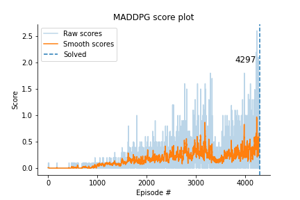

[//]: # (Image References)

[image1]: https://user-images.githubusercontent.com/10624937/42135623-e770e354-7d12-11e8-998d-29fc74429ca2.gif "Trained Agent"

# RL Collaboration and Competition

### Introduction
This project utilizes actor-critic deep reinforcement learning to solve a unity multi-agent environment with two agents 
cooperating in a tennis-like game (see gif below).

![Trained Agent][image1]

The agents are in control of the rackets and control them via a vector of length 2  with values ranging from -1 to 1 
corresponding to moving towards or away from the net as well as jumping. 
The environment state is observed via a 8 value vector that represents the position and velocity of the ball and racket.
The aim of the agents is to collaborate with one another and pass the ball back and forth without it touching the ground.

To model this joint goal, the agents receives a reward of +0.1 for each time the ball goes over the net and -0.01 
when the ball hits the ground or goes out of bound. 
We consider the environment solved once the agents have learned to cooperate and can together generate an average score 
of +0.5 over 100 consecutive episodes, taking the maximum score per episode from the two agents.

In this project we solve the environment using the multi-agent deep deterministic gradient policy (MADDPG) algorithm.

### Getting Started

1. Download the environment from one of the links below.  You need only select the environment that matches your operating system:
    - Linux: [click here](https://s3-us-west-1.amazonaws.com/udacity-drlnd/P3/Tennis/Tennis_Linux.zip)
    - Mac OSX: [click here](https://s3-us-west-1.amazonaws.com/udacity-drlnd/P3/Tennis/Tennis.app.zip)
    - Windows (32-bit): [click here](https://s3-us-west-1.amazonaws.com/udacity-drlnd/P3/Tennis/Tennis_Windows_x86.zip)
    - Windows (64-bit): [click here](https://s3-us-west-1.amazonaws.com/udacity-drlnd/P3/Tennis/Tennis_Windows_x86_64.zip)
    
    (_For Windows users_) Check out [this link](https://support.microsoft.com/en-us/help/827218/how-to-determine-whether-a-computer-is-running-a-32-bit-version-or-64) if you need help with determining if your computer is running a 32-bit version or 64-bit version of the Windows operating system.

    (_For AWS_) If you'd like to train the agent on AWS (and have not [enabled a virtual screen](https://github.com/Unity-Technologies/ml-agents/blob/master/docs/Training-on-Amazon-Web-Service.md)), then please use [this link](https://s3-us-west-1.amazonaws.com/udacity-drlnd/P3/Tennis/Tennis_Linux_NoVis.zip) to obtain the "headless" version of the environment.  You will **not** be able to watch the agent without enabling a virtual screen, but you will be able to train the agent.  (_To watch the agent, you should follow the instructions to [enable a virtual screen](https://github.com/Unity-Technologies/ml-agents/blob/master/docs/Training-on-Amazon-Web-Service.md), and then download the environment for the **Linux** operating system above._)

2. Place the file in the RL-collaboration GitHub repository, in the `resources/` folder, and unzip (or decompress) the file.  

To correctly install all the dependencies that is needed please follow the udacity guide [here](https://github.com/udacity/deep-reinforcement-learning#dependencies).

If you have problems to get things to work there is a python folder included here that contain everything that is needed
in regards to get unity agent and such requirements as torch=0.4.0 to work. One than have the option to install it via
```
pip -q install ./python
```

To further install specific packages used for visualization and such install the packages in the requirements.txt file.
```
pip install -r requirements.txt
```

### Project

The different agent is trained using a notebook based on the code retrieved from the Udacity reinforcement learning nanodegree.

* `tennis_maddpg.ipynb` - training of MADDPG agent in the collaborative tennis environment

information about the environment and algorithm details are documented in report.pdf


The resources folder contains plots, training checkpoints and raw metrics used to evaluate the trainings.
* `metrics` - folder contain raw numpy metrics for the training as well as the episode when the agent reached its goal
* `plots` - folder contains individual plots for each agent (both with and without smoothing) as well as a comparison.
* `weights` - contains the fully trained weights of the agents.

## Results

The following is the score plot of our MADDPG agent who managed to solve the environment in 4297 episodes.




One flaw of the results is that they are based of individual runs without extensive hyperparameter search and not an 
aggregated measurement of multiple runs with different random seeds. Also worth to note is the lack of a experience 
replay buffer as per the original MADDPG algorithm. 


For more extensicve discussion of the results and future work, see the [report](Report.pdf).